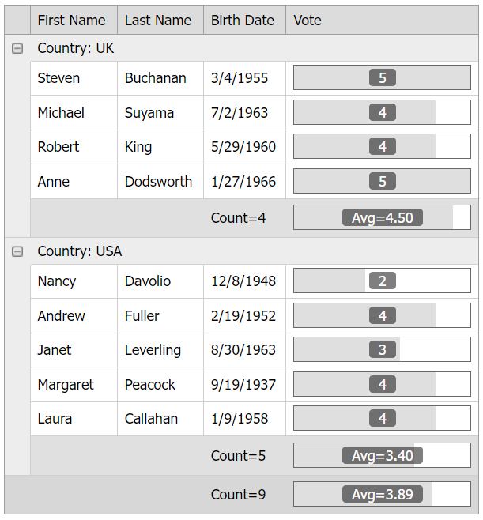

<!-- default badges list -->

[](https://supportcenter.devexpress.com/ticket/details/E4153)
[](https://docs.devexpress.com/GeneralInformation/403183)
[](#does-this-example-address-your-development-requirementsobjectives)
<!-- default badges end -->
# Grid View for ASP.NET Web Forms - How to use group footer and footer templates to customize group and total summaries

This example demonstrates how to create group footer and footer templates to replace default group and total summary items with average column values.



## Overview

Specify the grid's [TotalSummary](https://docs.devexpress.com/AspNet/DevExpress.Web.ASPxGridView.TotalSummary) and [GroupSummary](https://docs.devexpress.com/AspNet/DevExpress.Web.ASPxGridView.GroupSummary) properties. For summary items in the **Vote** column, specify their [Tag](https://docs.devexpress.com/AspNet/DevExpress.Web.ASPxSummaryItemBase.Tag) properties to access these items on the server.

```aspx
<TotalSummary>
    <dx:ASPxSummaryItem FieldName="Vote" SummaryType="Average" Tag="TotalVote" />
    <dx:ASPxSummaryItem FieldName="BirthDate" SummaryType="Count" />
</TotalSummary>
<GroupSummary>
    <dx:ASPxSummaryItem FieldName="Vote" ShowInGroupFooterColumn="Vote" SummaryType="Average" Tag="GroupVote" />
    <dx:ASPxSummaryItem FieldName="BirthDate" ShowInGroupFooterColumn="BirthDate" SummaryType="Count" />
</GroupSummary>
```

Specify the grid's [GroupFooterTemplate](https://docs.devexpress.com/AspNet/DevExpress.Web.GridViewColumn.GroupFooterTemplate) and [FooterTemplate](https://docs.devexpress.com/AspNet/DevExpress.Web.GridViewColumn.FooterTemplate) properties and add progress bars to the templates to replace default summary items and display average values in the **Vote** column.

```aspx
<dx:GridViewDataProgressBarColumn FieldName="Vote">
    <PropertiesProgressBar Minimum="0" Maximum="5" DisplayMode="Position" Width="150" />
    <GroupFooterTemplate>
        <dx:ASPxProgressBar ID="GroupProgressBar" runat="server" Minimum="0" Maximum="5" DisplayMode="Custom" 
            Width="150" CustomDisplayFormat="Avg={0}" DisplayFormatString="{0:N2}" 
            Value='<%# GetGroupSummaryValue(Container) %>' />
    </GroupFooterTemplate>
    <FooterTemplate>
        <dx:ASPxProgressBar ID="TotalProgressBar" runat="server" Minimum="0" Maximum="5" DisplayMode="Custom" 
            Width="150" CustomDisplayFormat="Avg={0}" DisplayFormatString="{0:N2}"
            Value='<%# GetTotalSummaryValue() %>' />
    </FooterTemplate>
</dx:GridViewDataProgressBarColumn>
```

To get summary items' values, call the grid's server-side [GetGroupSummaryValue](https://docs.devexpress.com/AspNet/DevExpress.Web.ASPxGridView.GetGroupSummaryValue(System.Int32-DevExpress.Web.ASPxSummaryItem)) and [GetTotalSummaryValue](https://docs.devexpress.com/AspNet/DevExpress.Web.ASPxGridView.GetTotalSummaryValue(DevExpress.Web.ASPxSummaryItem)) methods as follows:

```cs
protected object GetGroupSummaryValue(GridViewGroupFooterCellTemplateContainer container) {
    var summaryItem = Grid.GroupSummary.First(i => i.Tag == "GroupVote");
    return Grid.GetGroupSummaryValue(container.VisibleIndex, summaryItem);
}
protected object GetTotalSummaryValue() {
    var summaryItem = Grid.TotalSummary.First(i => i.Tag == "TotalVote");
    return Grid.GetTotalSummaryValue(summaryItem);
}
```

To customize a progress bar's display mode, set the control's [DisplayMode](https://docs.devexpress.com/AspNet/DevExpress.Web.ASPxProgressBar.DisplayMode) property to `Custom` and specify the [CustomDisplayFormat](https://docs.devexpress.com/AspNet/DevExpress.Web.ASPxProgressBar.CustomDisplayFormat) property.

## Files to Review

* [Default.aspx](./CS/WebSite/Default.aspx) (VB: [Default.aspx](./VB/WebSite/Default.aspx))
* [Default.aspx.cs](./CS/WebSite/Default.aspx.cs) (VB: [Default.aspx.vb](./VB/WebSite/Default.aspx.vb))

## Documentation

* [Grid View Templates](https://docs.devexpress.com/AspNet/3718/components/grid-view/concepts/templates)
* [Grid Data Summaries](https://docs.devexpress.com/AspNet/3717/components/grid-view/concepts/use-data-summaries)
<!-- feedback -->
## Does this example address your development requirements/objectives?

[](https://www.devexpress.com/support/examples/survey.xml?utm_source=github&utm_campaign=asp-net-web-forms-grid-replace-group-and-total-summaries-with-templates&~~~was_helpful=yes) [](https://www.devexpress.com/support/examples/survey.xml?utm_source=github&utm_campaign=asp-net-web-forms-grid-replace-group-and-total-summaries-with-templates&~~~was_helpful=no)

(you will be redirected to DevExpress.com to submit your response)
<!-- feedback end -->
